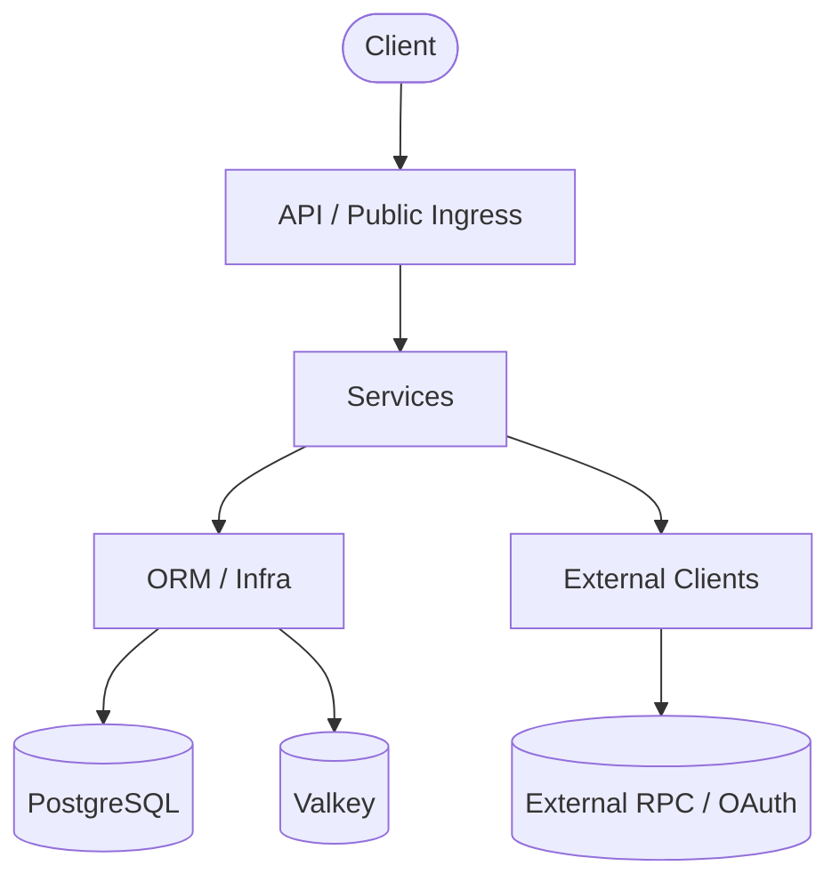

# Backend architecture

## Purpose

This file is the backend architecture entry point. It covers top-level layering, global dependency direction, and the
architecture index. Protocol orchestration, runtime state, and infrastructure details live in `docs/architecture/`.

```text
app/                        # Main application package
├── __init__.py             # FastAPI application factory
├── __main__.py             # Uvicorn entry point
├── service_state.py        # Manager assembly shared by API and Worker
├── api/                    # Control-plane and public protocol ingress
├── services/               # Use cases, managers, and data-plane orchestration
├── model/                  # Pydantic contracts and immutable internal models
├── orm/                    # Tortoise ORM models, fields, and mixins
├── clients/                # External HTTP and RPC clients
├── infra/                  # PostgreSQL, Valkey, cache, and TaskIQ adapters
├── core/                   # Configuration, lifecycle, responses, and context
├── util/                   # Cross-domain pure utilities
├── cli/                    # Standalone CLI entry points
└── middleware/             # ASGI middleware
jobs/                       # TaskIQ Worker and Scheduler tasks
migrations/                 # Tortoise ORM migrations
scripts/                    # Operations and stress verification
tests/                      # Pytest suite
```

## Layers and dependency direction



Global rules:

- Dependencies flow **API -> Services -> ORM / Clients / Infra**. `clients` and `infra` do not depend on API or
  services.
- The control plane owns mutable configuration and audits. The data plane consumes immutable plans and snapshots and
  does not read control-plane ORM rows directly.
- Public Access provides shared Host/Transport, identity, and Gateway context only. Each public protocol owns its
  ingress, admission, forwarding, error mapping, and control-plane models.
- Runtime State accepts normalized observations and outcomes. It does not parse raw protocol traffic or depend on
  forwarding or cache modules.
- Endpoint is the outbound resource boundary. Protocol forwarding calls upstreams only through Endpoint Access and
  never reads URLs, encrypted credentials, or connection objects directly.
- Create modules only for implemented behavior; do not add empty protocol packages, generic routers, or placeholders.

## Architecture topics

| Topic | Scope |
|---|---|
| [Platform and infrastructure](./docs/architecture/platform.md) | Lifecycle, routing and DI, data, configuration, tasks, errors, and tests |
| [Public protocol boundaries](./docs/architecture/public-protocols.md) | Public Access, protocol lifecycle, sharing, and isolation |
| [JSON-RPC data plane](./docs/architecture/jsonrpc-data-plane.md) | JSON-RPC routes, forwarding, System Cache, and admission |
| [HTTP API data plane](./docs/architecture/http-api-data-plane.md) | HTTP API routes, forwarding, Tron adapter, retry, and admission |
| [Runtime State](./docs/architecture/runtime-state.md) | Endpoint Health and Tip, Chain Tip, and Circuit Breaker |

See [System JSON-RPC Cache](./docs/system-jsonrpc-cache.md) for cache policy, storage, and stress verification. See
[Rate limiter](./docs/middleware/LIMITER.md) for the distinction between control-plane limiting and protocol admission.

## Change requirements

- When changing a cross-layer contract, check API models, service protocols, ORM/client adapters, assembly, and callers.
- When changing a protocol request lifecycle, update the matching data-plane document instead of moving details here.
- When changing environment variables, startup order, or runtime dependencies, update the platform document,
  `.env.example`, and the root README.
- When changing storage, add the corresponding migration. V2 deploys from an empty database baseline and does not
  migrate V1 data.
